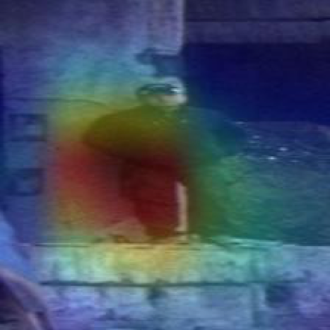
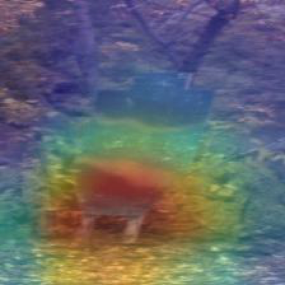
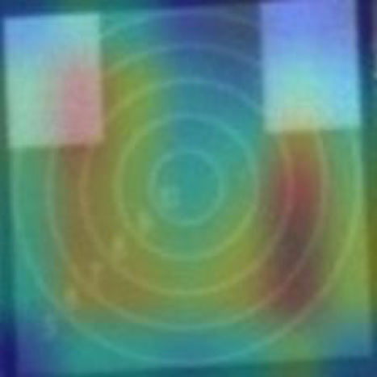
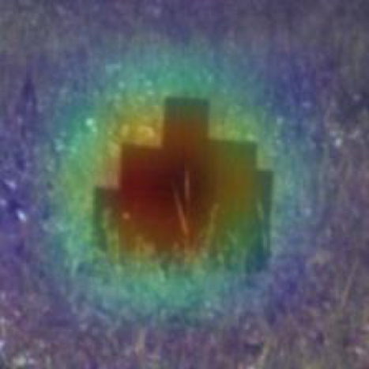

# Digital League Hackathon

## Problem

In military affairs, decisions need to be made very quickly. To reduce the probability of human error, there is a need in a model that predicts the type of object in front: the type of target or person. The dataset contains images with people and 4 types of targets: a human-shaped target, a laser target, a pistol target, tank targets.

## Metric

Classes are imbalanced, so the metric is balanced accuracy. Moreover, the error in the prediction of a person is higher than from the predictions of targets.

Balanced accuracy = 0.4 * human + 0.3 * target of human + 0.09 * laser target + 0.12 * gun target + 0.06 * tank target

## Solution

Images are normalized on *mean* and *std* of the train dataset, because the color distribution in the images is shifted towards the brown and green shades of grass and earth.

Valid data augmetations are applied: horisontal flip is valid, so it was applied; rotations and vertical flips are not valid for the task, so they were not applied.

Model should make a prediction in realtime, so small and fast ResNet-18 chosen. It was trained for 10 epochs. During training class-by-class accuracy and balanced accuracy were tracked.

## Results

Balanced accuracy 97.68% on test.

Results of network prediction were interpreted via saliency maps. Neurons are correctly activated on human and targets, not on the background:

Human | Target of human | Laser target | Gun target | Tank target
:---:|:---:|:---:|:---:|:---:
 |  |  |  | 
 